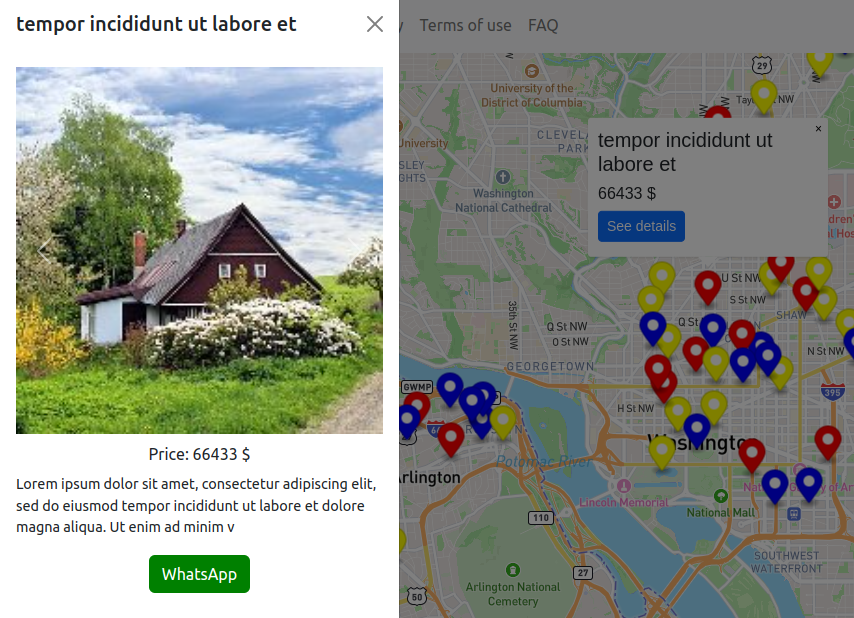

# Web mapping Z-3

This is a static website with an interactive map embedded. This site has about, privacy, terms, FAQ, and main pages. The main page is a Mapbox map that contains fake markers, each with a popup that shows short information. When the popup is opened, it shows a button to open an off-canvas that contains more details. The map also has a button to filter the markers based on color.

## Live Demo
[https://webmappingz3.pages.dev](https://webmappingz3.pages.dev)

## Built with
* [Bootstrap](https://getbootstrap.com/)
* [Mapbox](https://www.mapbox.com/)
* [Vue.js](https://vuejs.org/)

## How to use
After cloning this project on your local machine, go to mapbox.com, create an account, a get a token. Open the main file "App.vue" find this variable "mapboxgl.accessToken" and paste your token there.

## License

[The Unlicense](https://unlicense.org/) 

## Contact

finprogrammer@mailfence.com

  